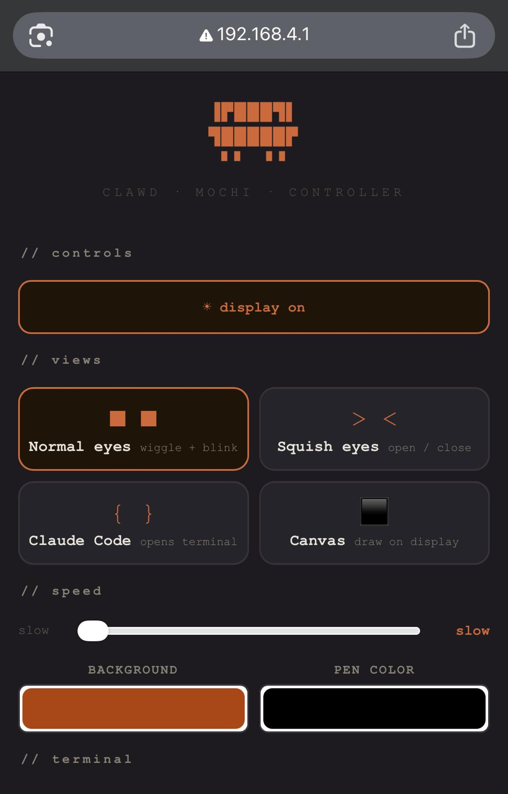

<!-- LOGO -->
<p align="center">
  
</p>

# Clawd Mochi 🦀🤖

A physical desk companion inspired by **Clawd** — the pixel-crab mascot of Claude Code by Anthropic. An ESP32-C3 drives a 1.54" color TFT display and hosts a mobile web controller, USB serial controls, Codex / Claude Code progress display, and browser-based OTA updates — no app, internet, or cloud required.

**Cost: ~$6–8 · Build time: ~1 hour · Skill level: Beginner**

📦 3D printable case on MakerWorld: [https://makerworld.com/en/models/2559505-clawd-mochi-physical-claude-code-mascot#profileId-2820000](https://makerworld.com/en/models/2559505-clawd-mochi-physical-claude-code-mascot#profileId-2820000)

---

> ⚠️ This is an independent fan project. It is not affiliated with, sponsored by, or endorsed by Anthropic. "Claude" and "Clawd" are trademarks of Anthropic.

---

<p align="center">
  
  &nbsp;
  
</p>

## What it does

Clawd Mochi sits on your desk and shows animated expressions or your current Codex / Claude Code work phase on a small color display. You control it from any phone or browser through its built-in WiFi hotspot or, after setup, through your normal 2.4 GHz LAN:

- **Companion expressions** — normal, focus, and happy eyes
- **Codex / Claude Code work status** — IDLE, PLAN, CODE, TEST, DONE, and BLOCK phases
- **Web controller** — screen controls, backlight toggle, network settings, and OTA upload
- **USB serial automation** — push state from scripts when WiFi is unavailable

---

## Parts list

| Part                | Spec                             | ~Price |
| ------------------- | -------------------------------- | ------ |
| ESP32-C3 Super Mini | microcontroller with WiFi        | ~$2.50 |
| ST7789 1.54" TFT    | 240×240 SPI color display        | ~$3.00 |
| 8 short wires       | 8–10 cm Dupont / jumper wires    | ~$0.50 |
| 2× M2×6mm screws    | to mount display bezel           | ~$0.10 |
| Double-sided tape   | to secure components inside case | ~$0.10 |
| USB-C cable         | for power                        | —      |
| 3D printed case     | PLA or PETG, ~30g                | ~$0.50 |

**Total: ~$7–8**

---

## Wiring

> ⚠️ Connect VCC to **3.3V only** — never 5V. Use GPIO 8 and 10 for SPI (hardware SPI, fast). Do not use GPIO 6/7 for SPI.

| Display pin | ESP32-C3 GPIO  | Wire color (suggested) |
| ----------- | -------------- | ---------------------- |
| VCC         | 3V3            | Red                    |
| GND         | GND            | Black                  |
| SDA         | GPIO 10 (MOSI) | Orange                 |
| SCL         | GPIO 8 (SCK)   | Green                  |
| RES         | GPIO 2         | Purple                 |
| DC          | GPIO 1         | Blue                   |
| CS          | GPIO 4         | White                  |
| BL          | GPIO 3         | Yellow                 |

---

## Software setup

### Step 1 — Install Arduino IDE

Download [Arduino IDE 2.x](https://www.arduino.cc/en/software) and install it.

### Step 2 — Add ESP32 board support

1. Open Arduino IDE → **File → Preferences**
2. In "Additional boards manager URLs" paste:
   ```
   https://raw.githubusercontent.com/espressif/arduino-esp32/gh-pages/package_esp32_index.json
   ```
3. Go to **Tools → Board → Boards Manager**, search `esp32`, install **"esp32 by Espressif Systems"**

### Step 3 — Install libraries

Go to **Tools → Library Manager** and install both:

- `Adafruit GFX Library`
- `Adafruit ST7735 and ST7789 Library`

### Step 4 — Configure board settings

Go to **Tools** and set:

| Setting         | Value                   |
| --------------- | ----------------------- |
| Board           | ESP32C3 Dev Module      |
| USB CDC On Boot | **Enabled** ← important |
| CPU Frequency   | 160 MHz                 |
| Upload Speed    | 115200                  |

### Step 5 — Upload the sketch

1. Clone or download this repo
2. Open `clawd_mochi/clawd_mochi.ino` in Arduino IDE
3. Connect the ESP32 via USB-C
4. Select the correct port under **Tools → Port**
5. Click **Upload** (→ arrow button)
6. Wait for "Hard resetting via RTS pin..." — this means success

---

## How to use it

### First-time network setup

1. Power the ESP32 via USB-C (any USB charger or power bank)
2. Wait ~3 seconds for the boot animation to finish
3. On your phone, go to **WiFi settings**
4. Connect to the network: **`ClaWD-Mochi`** · password: **`clawd1234`**
5. Open a browser and go to **`http://192.168.4.1`**
6. Open **Network settings**, choose a 2.4 GHz WiFi network, enter the password, and save
7. After connection, use the LAN IP shown on the screen or network page

ESP32-C3 only supports 2.4 GHz WiFi. The `ClaWD-Mochi` hotspot always stays available for recovery and reconfiguration at `http://192.168.4.1/network`.

### Daily use

Your computer or phone can stay on its normal WiFi. Open the LAN IP shown on the device to use the controller or OTA page.

You should see the web controller:



### Controller features

| Button / control   | What it does                                    |
| ------------------ | ----------------------------------------------- |
| Normal             | Shows the default Clawd eyes                    |
| Focus              | Shows the focus expression                      |
| Happy              | Shows the happy expression                      |
| Backlight          | Toggles the display backlight                   |
| Network settings   | Joins or clears a saved 2.4 GHz WiFi network   |
| OTA update         | Uploads a compiled ESP32-C3 `.bin` firmware     |
| Refresh status     | Reloads the current device and Codex state      |

The work-status panel is read-only for phases. The Web UI can switch Display Mode between Auto, Codex, and Claude; the local watcher pushes the final phase update to the device.

### Codex / Claude Code status display

The firmware accepts these work status states:

| Phase | Meaning |
| --- | --- |
| OFFLINE | The client is offline; return to the default Clawd animation |
| IDLE | The client is online and ready, with no active task |
| PLAN | Planning, stage 1/4 |
| CODE | Working, stage 2/4 |
| TEST | Verifying, stage 3/4 |
| DONE | Complete, stage 4/4 |
| BLOCK | Waiting for required input, red full-stage display |

`OFFLINE` is not a work phase. It is used when the selected client is not open, the watcher is not running, or the device-side heartbeat times out. Codex states use the Codex core-pulse layer; Claude Code states use the Claude Code Style Layer.

Display Mode:

- `Auto`: selects by status importance first, then by most recent activity.
- `Codex`: only Codex can drive the work-status layer.
- `Claude`: only Claude Code can drive the work-status layer.

The Auto priority is `BLOCK > TEST > CODE > PLAN > DONE > IDLE > OFFLINE`. Display Mode is runtime-only and resets to `AUTO` after reboot.

The Codex watcher prefers JSONL lifecycle events: it switches to `DONE` when the latest turn writes `task_complete`. If a source has no lifecycle events, the watcher falls back to the older mtime heuristic.

From Windows PowerShell:

```powershell
powershell -ExecutionPolicy Bypass -File .\tools\codex-stage.ps1 -State CODE -Message editing
powershell -ExecutionPolicy Bypass -File .\tools\codex-stage.ps1 -State TEST -Message verifying
powershell -ExecutionPolicy Bypass -File .\tools\codex-stage.ps1 -State OFFLINE -Message codex-offline
```

`tools/codex-stage.ps1` tries WiFi HTTP first and falls back to `COM7` USB serial. For a LAN-connected device, pass `-DeviceUrl http://device-lan-ip`.

On WSL / Linux / macOS, run the unified watcher:

```bash
./tools/agent-watch.sh --device-url http://device-lan-ip --background
./tools/agent-watch.sh --status
./tools/agent-watch.sh --stop
./tools/agent-watch.sh --once --mode auto --verbose
```

`agent-watch.sh` observes Codex at `~/.codex/sessions` and Claude Code at `~/.claude/projects` by default. The older single-client watchers remain available for compatibility and troubleshooting, but do not run the Codex and Claude single-client watchers together against the same device for multi-client display.

Protocol smoke test:

```bash
curl "http://device-lan-ip/agent-mode?mode=auto"
curl "http://device-lan-ip/state"
curl "http://device-lan-ip/progress?state=OFFLINE&msg=agents-offline&source=none"
```

Manual USB serial commands use 115200 baud:

```text
STATE
CMD normal
BL 0
BL 1
PROGRESS PLAN planning
PROGRESS CODE editing
PROGRESS TEST verifying
PROGRESS DONE complete
PROGRESS BLOCK need-input
PROGRESS IDLE
PROGRESS OFFLINE codex-offline
```

`STATE` returns one line of JSON.

### OTA updates

The first flash still requires USB. After that, upload an ESP32-C3 `.bin` firmware from:

```text
http://device-lan-ip/ota
http://192.168.4.1/ota
```

See [OTA update guide](docs/ota-update.zh-CN.md) and [USB / Codex serial guide](docs/usb-serial-codex.zh-CN.md) for the current operational details.

---

## 3D case

The electronics case (body + back) is in the `clawd_mochi` model folder:

| File                                                                                 | Description                               |
| ------------------------------------------------------------------------------------ | ----------------------------------------- |
| [`./models/clawd_mochi/clawd_mochi_v1.stl`](./models/clawd_mochi/clawd_mochi_v1.stl) | Main case layout with body and back parts |

### Print settings

| Setting      | Value                               |
| ------------ | ----------------------------------- |
| Material     | PLA or PETG                         |
| Layer height | 0.15–0.20 mm                        |
| Infill       | 15% gyroid                          |
| Supports     | Yes — for display window overhang   |
| Orientation  | Face-down, flat back on build plate |

Suggested colors: orange PLA for body, matte black for back plate.

You can also download the models from MakerWorld: [https://makerworld.com/en/models/2559505-clawd-mochi-physical-claude-code-mascot#profileId-2820000](https://makerworld.com/en/models/2559505-clawd-mochi-physical-claude-code-mascot#profileId-2820000)

### 3D Clawd (no electronics)

If you just want a display piece, use the separate 3D Clawd model (no screen or electronics cutouts).


Model files:

| File | Description |
| ---- | ----------- |
| [`./models/clawd_3d/clawd_3D_no_AMS.stl`](./models/clawd_3d/clawd_3D_no_AMS.stl) | Original Clawd 3D model |
| [`./models/clawd_3d_squished_eyes/clawd_3D_squished_eyes_no_AMS.stl`](./models/clawd_3d_squished_eyes/clawd_3D_squished_eyes_no_AMS.stl) | Squished eyes variant |

You can also download the models from MakerWorld: [https://makerworld.com/en/models/2576503-clawd-claude-code-mascot#profileId-2841183](https://makerworld.com/en/models/2576503-clawd-claude-code-mascot#profileId-2841183)

---

## Assembly tips

1. Print the case file (body + back) and test-fit the display before gluing anything
2. Thread the 8 wires through the back plate slot before soldering
3. Use double-sided tape to fix the ESP32 against the inside of the back plate
4. Secure the display with 2× M2×6mm screws through the bezel holes
5. Route the USB-C cable through the back plate slot and snap the back on

---

## Customisation

### Eye size and position

Edit these constants near the top of `clawd_mochi.ino`:

```cpp
#define EYE_W   30    // eye width in pixels
#define EYE_H   60    // eye height in pixels
#define EYE_GAP 120   // gap between eyes
#define EYE_OX  0     // horizontal offset
#define EYE_OY  40    // vertical offset upward
```

### Logo animation duration

```cpp
// In animLogoReveal() — how long logo holds after animation
delay(1500);       // milliseconds — change this number

// Speed of the reveal drawing stroke by stroke
delay(speedMs(8)); // lower = faster
```

---

## Contributing

Contributions are very welcome! Here are some ideas:

- **New animations** — add new expressions, transitions, or idle behaviors
- **New views** — weather display, clock, notification badges, pixel art scenes
- **Sound** — add a small buzzer for sound effects
- **Sensors** — connect a touch sensor or button for physical interaction
- **MQTT / Home Assistant** — connect to smart home platforms

To contribute: fork the repo, make your changes, and open a pull request. Please keep the single-file structure (`clawd_mochi.ino`) so it stays easy for beginners to flash.

## License

This project is licensed under the MIT License — see the [LICENSE](LICENSE) file for details.

**Note:** 3D models and media assets are licensed under **CC BY-NC-SA 4.0**.
